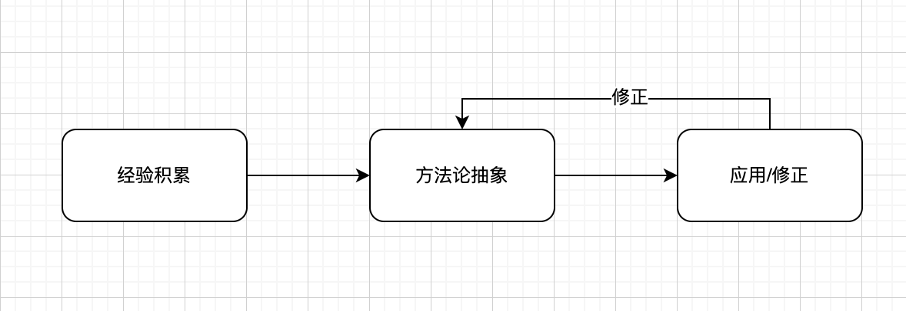

## 谈谈如何学习架构

最近在重新看许式伟的架构课，有感而发写了两篇文章，然后就有不少人微信问我该怎么学架构，该看什么资料。所以抽空写一篇文章谈谈我的一些学习经验和感受吧，当然也自己总结总结，好坏对错大家自行判断。以前我一直认为架构这个东西跟设计（艺术）很像，不同的角度有不同的看法，好和坏的评价并不能那么的绝对，所以也一直没有去总结方法论，好像看的多了用的多了，能力自然而然也就起来了。

而且网上大部分的架构课，也都是在教你经验（或者结论）。比如微服务架构设计、高可用架构设计、异地多活的设计、高性能架构等等，这些都是偏技术的，再比如还有一些，如何设计一个电商网站架构、如何做一个秒杀系统等等。还有一类是讲理论方法（结合实战）或者讲设计模式的。而且你多去看看会发现，好多人讲的方法和理论还都差别挺大，你信谁呢？

我一直认为架构学习就是经验性的积累，到方法论的抽象，再到实际打磨修正的过程。有经验是个非常好的事情，他可以帮你提前判断风险，提升可行性和成功的概率。方法论是帮你，在遇到复杂场景或者新场景下，作出判断的准则（可能这个准则只属于你，但也很好，能自我建立一套行之有效的准则，绝对是有价值的）。​

今天就从这经验性的积累、方法论抽象和打磨修正三个过程来讲讲该​如何去做。经验帮你解决已知的同类型问题，方法论帮你解决同领域下未知的问题，打磨修正是来检验你的这个方法论，不断提升​判断的准确度。​

​

### 经验积累

如果你只会写业务代码，不考虑如何抽象，那你就是个搬砖的；如果哪天你花时间去思考重构你的代码，那恭喜你走出了重要的一步，当然你还是个搬砖的。重构什么？怎么重构？怎么样算写的更好？这里的判断来源就是你的经验和方法论。假设你只会写if/else，无论怎么重构，也只是把if/else改成switch最多了。没看过设计模式，可能根本就想不到像策略模式。没看过java8，可能也想不到用optional来做。所以，这就是经验的重要性。这个例子其实不是太好，因为当你没经验的时候，你也要多思考，思考如何追求极致。因为我发现很多牛逼的架构师，都很会用极限的方式思考问题。

经验的积累确实是花时间的，也快不了。这里说说我的一些方式吧。主要路径就两个，一个是看各种优秀的框架；另一个是跟着优秀的人学习。学架构无外乎两种，广度和深度。这里又有很多人要纠结了，我是先广度和还是先深度。我的答案很简单，根据你的工作性质来。如果你是从事业务相关的开发，先广度，因为你日常中面临更多的是选择。如果你从事的是偏向某一领域的技术型开发，那就先深度，因为你会发现那样对你的工作产出效果更大。无论，先选哪个，请选定了就坚持下去，不要摇摆。这里给个简单的方法，把想做的事情列出来，就选其中最核心的5条，用一年时间搞定。

我向来的推荐是看各种优秀的框架。因为这个你工作能直接用上。看design、看代码。而不是上来就看很多设计模式这样的理论。好的框架代码，是完全可以看懂，并能拆分清楚他的层次结构的。另外，钻研里面的细节，比如zero-copy怎么实现，比如c10000的问题怎么优化。这样的问题看多了，自然就积累了很多实际的经验。另外，开头说的容灾架构、高可用架构类的分享和经验，也可以多听听，作为一个思路，以后要用到了，可以拿出来少走一些弯路。当然，如果这些经验不是你自己的，在使用的时候一定小心，复制照抄过程往往容易踩坑，而学习经验得来的思考逻辑会让你更有判断力。

看内容，建议用ppt来记录，一边看一边总结记录，看完了，ppt总结完了，能直接给别人分享，一下子就知道了你自己掌握了多少。看代码，记得自写一下，再怎么debug过程，不如自己把核心的写一遍。

### 方法论抽象

这个是我之前一直忽略没有去做的，直到最近才幡然醒悟，这是能不能在架构师上再往上爬一层很关键的因素。最近我一直在思考一个问题，如何提升自己对一些商业机会判断的成功率。举个例子，像我目前在做的实时音视频领域，产品的品质固然很关键，但似乎已经错过了靠产品品质能打天下的阶段，这个时候，我们就把关注度放在了业务上（方案场景）。tob要面对的客户来自各个领域，社交、金融、电商、工作等等，那在你有限的资源下，如果去选择一个方向，并且这个方向还能让你赚钱？这是个很难的选择。真的是凭感觉的吗？一定不是。从商业上讲，自己看得太少了，更关键的是没有理论和分析问题的框架来支撑自己，导致遇到问题，连分析可能都是做不到位的。

这里有个比较好的方法来帮助你建立和思考逻辑。就是假设一切都回到原点，如果你来设计这个架构，你会怎么做。所以我为什么之前的文章里写概要设计那么重要，写的好，可以帮助你很好的拆解思路。举个例子，就拿后端都非常熟悉的spring框架来讲，我们刚学的时候，都知道这个两个重要的能力IoC和AOP。假设我们跳过需求分析这一步（现实中，你最好不要跳过，因为这步在我看来更重要），今天让你设计一个IoC的能力，你会如何去做。写一个map，然后帮助配置了的对象初始化，扔到这个map中去，调用的时候，从这个map中去拿。好像是个思路，那对象是否要考虑生命周期？生命周期的每个环节是否要考虑这个对象的开放性？有了开放性之后，怎么保证核心的不被破坏？所以，重新设计的过程，也是一个不断拆解的过程，拆解到不能再拆解为止，这个设计是否经得住考验，就看是否能够被拆解清楚。

基于你自己的拆解，然后再回过去对比已有框架的设计，两者相比较，不一样的地方，去琢磨透作者的想法，如果你认同，那就记录下来，形成你最的想法。一来二去，这样的想法多了之后，你自然就形成了一些可以呼之即来的方法论。

### 应用/修正

应用是为了修正。在你没把握之前，尽可能先自己拿一些项目练练手，别上去就大刀阔斧的改现有的线上业务，存在即合理。当你有机会能够操刀的时候，又对自己的积累有所信心的话，那就站出来去主导他。主导和配合两个角色完全不同，设计和提意见是两回事情。所以，要成为一个好的架构师，必须要敢于站出来，敢于承担责任，甚至随时做好失败的风险。

这一节，不做过多的解读，最主要的就是要抓住机会去实践，没有机会，自己给自己创造机会。

大家也可以在评论区推荐推荐，也谈谈自己的学习经验，大家相互学习。
