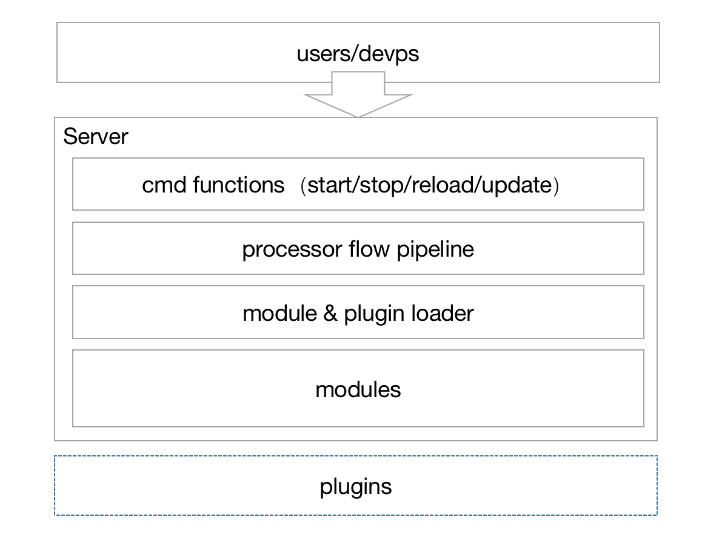

# QUIC-Gateway Design

## Goal

* 无论信令网关还是服务网关（面向移动端的移动网关），非常重要的指标是弱网抗性，本次目标很大程度上是为了提升服务的弱网抗性。网关主要采用QUIC来做，但是针对协议需要有兜底和切换的能力

* 希望有一个扩展性比较好的网关，可以承载部分业务处理（如信令的处理），也可以作为服务的proxy（service proxy）等

* 支持无状态化的server集群

## Features

* 一个标准的server instance（支持start/stop/update/reload等操作），支持cmd和类nginx conf解析 （内部采用module方式进行管理）

* 多个server可基于规则进行水平扩展（server本身无状态）

* 支持协议的选择（quic/h2/h1.1）

* 支持http端连接和长连接/rpc service的网关proxy （采用plugin的方式进行扩展）

* high preformance is very important

## Archtechure

server instance hold modules and it can install third part plugins 

这里的代码实现我会参考caddy的部分设计，原因很简单，不想重复造轮子。但是caddy的设计我觉得并不是太好。从1.0到2.x的版本，把模块化管理做的更清晰了，但最核心部分的层次结构没有改，这个比较遗憾。导致了代码的结构并不能很顺畅的表达运行的结构。

所以在gateway的层次结构设计上我会基本沿用之前在mogu时候写的网关框架（jaguar-web，比较可惜当时没能把它开源掉）来做。

modules为内部的模块，主要用于协议、proxy、file、static等模块的管理。

plugin开放给第三方，比如可以实现信令的业务、内部proxy到gRPC此类的service。

server通过pipeline来整合modules和plugin，无非不同的是，module不对外开放，而plugin支持外部集成。会在pipeline上开一些扩展点。

server的行为采用cmd的方式进行管理和对外暴露，这里暂时没想好如何设计api的方式进行暴露。

所以最后的执行链应该是：

user/api-->cmd-->server listen-->pipeline-->response
                                 
其中在pipeline执行中可能为：

module1-->module2-->plugin1-->module3-->plugin2-->

## Detail

## Extension

